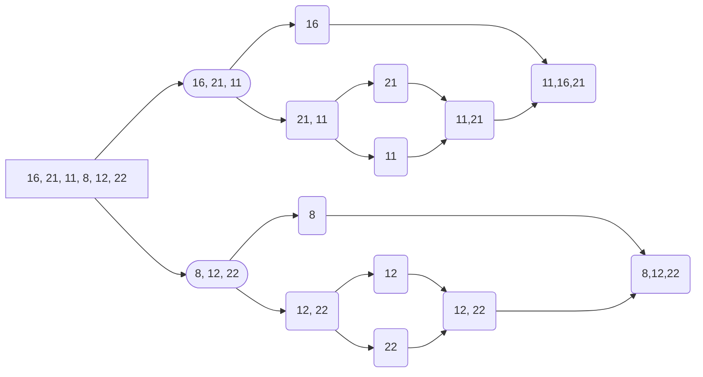

# Veri Yapıları ve Algoritmalar Patika.dev Proje 2 Çözümleri

## Soru 1: [16,21,11,8,12,22] -> Merge Sort

## Soru 2: Yukarıdaki dizinin sort türüne göre aşamalarını yazınız.

**Aşamalar:**

Adım 1 : [16, 21, 11] | [8, 12, 22]  

Adım 2: [16] | [21, 11] | [8] | [12, 22]  

Adım 3: [16] | [21] | [11] | [8] | [12] | [22]

Adım 4: [16] | [11, 21] | [8] | [12]  [22]

Adım 5: [16] | [11, 21] | [8] | [12, 22]

Adım 6: [11, 16, 21] | [8, 12, 22]

Adım 7: [8, 11, 12, 16, 21, 22]  

## Soru 3: Big-O gösterimini yazınız.

Merge Sort'un Big-O gösterimi O(n log n)'dir.

