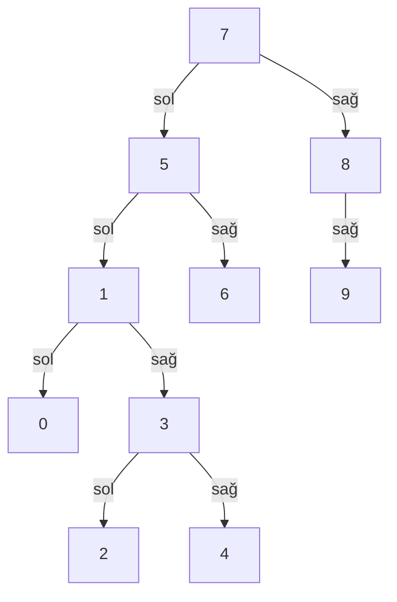

# Veri Yapıları ve Algoritmalar Patika.dev Proje 3 Çözümleri

## Soru 1: [7, 5, 1, 8, 3, 6, 0, 9, 4, 2] dizisinin Binary-Search-Tree aşamalarını yazınız.

**Aşamalar:**

Adım 1 :  İlk Eleman (7) olduğu için root 7 olur.

Adım 2 :  İkinci Eleman (5) ve 5, 7'den küçük olduğundan, 7'nin soluna yerleştirilir.

Adım 3 : Üçüncü Eleman (1); 1, 7'den küçük olduğundan, 7'nin soluna yerleştirilir. 1, 5'ten küçük olduğundan, 5'in soluna yerleştirilir.

Adım 4 : Dördüncü Eleman (8); 8, 7'den büyük olduğundan, 7'nin sağına yerleştirilir.

Adım 5 : Beşinci Eleman (3); 3, 7'den küçük olduğundan, 7'nin soluna yerleştirilir. 3, 5'ten küçük olduğundan, 5'in soluna yerleştirilir. 3, 1'den büyük olduğundan, 1'in sağına yerleştirilir.

Adım 6 : Altıncı Eleman (6); 6, 7'den küçük olduğundan, 7'nin soluna yerleştirilir. 6, 5'ten büyük olduğundan, 5'in sağına yerleştirilir.

Adım 7 : Yedinci Eleman (0); 0, 7'den küçük olduğundan, 7'nin soluna yerleştirilir. 0, 5'ten küçük olduğundan, 5'in soluna yerleştirilir. 0, 1'den küçük olduğundan, 1'in soluna yerleştirilir.

Adım 8 : Sekizinci Eleman (9); 9, 7'den büyük olduğundan, 7'nin sağına yerleştirilir. 9, 8'den büyük olduğundan, 8'in sağına yerleştirilir.

Adım 9 : Dokuzuncu Eleman (4); 4, 7'den küçük olduğundan, 7'nin soluna yerleştirilir. 4, 5'ten küçük olduğundan, 5'in soluna yerleştirilir. 4, 3'ten büyük olduğundan, 3'ün sağına yerleştirilir.

Adım 10 : Onuncu Eleman (2); 2, 7'den küçük olduğundan, 7'nin soluna yerleştirilir. 2, 5'ten küçük olduğundan, 5'in soluna yerleştirilir. 2, 1'den büyük olduğundan, 1'in sağına yerleştirilir. 2, 3'ten küçük olduğundan, 3'ün soluna yerleştirilir.

